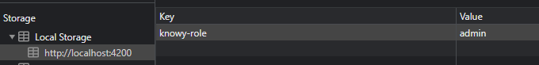
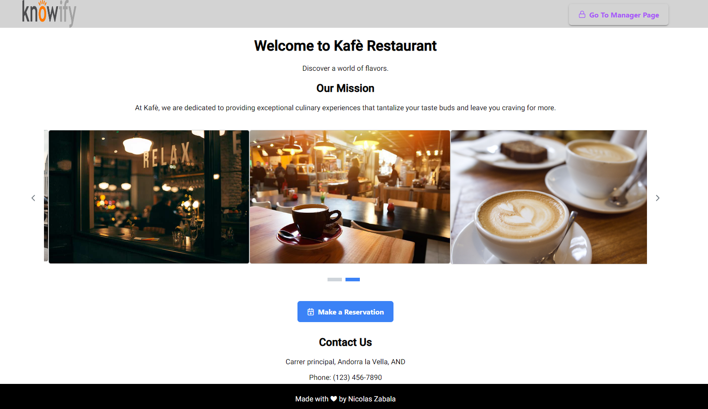
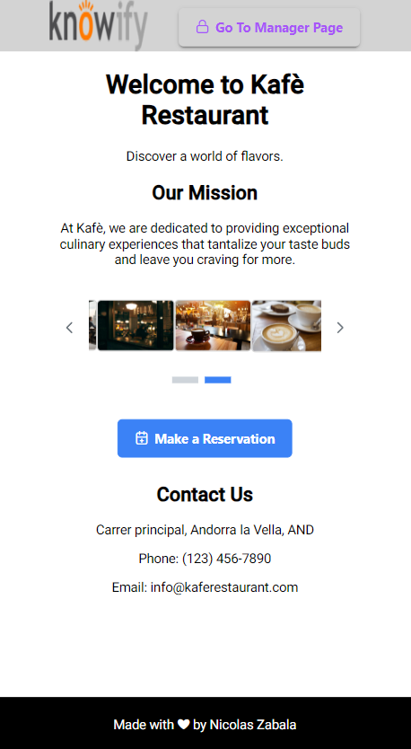
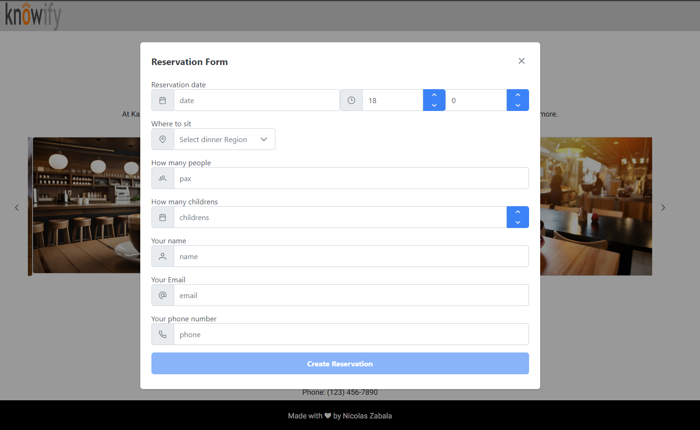
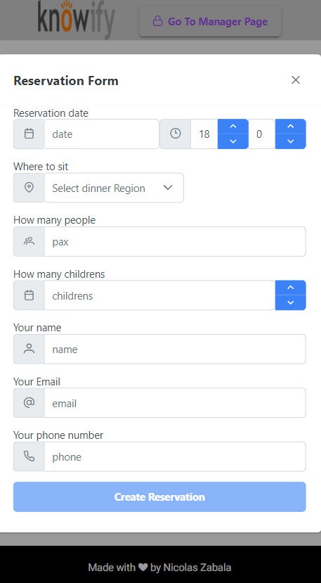
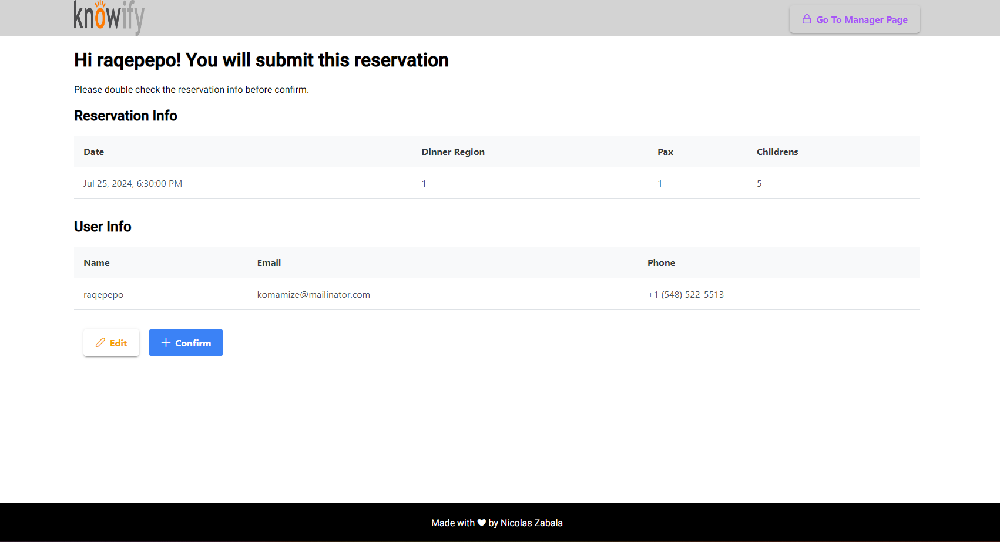
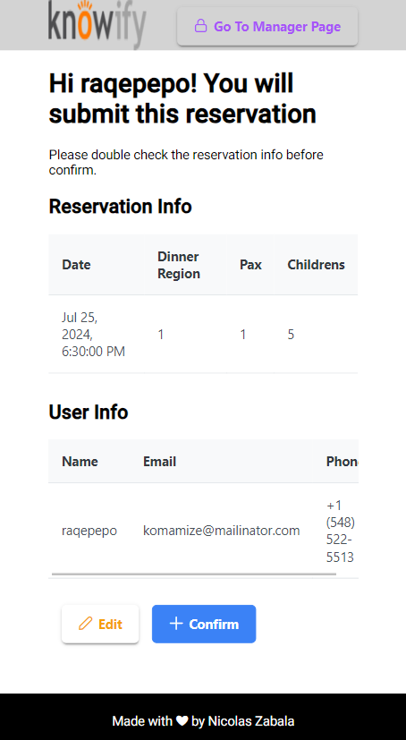
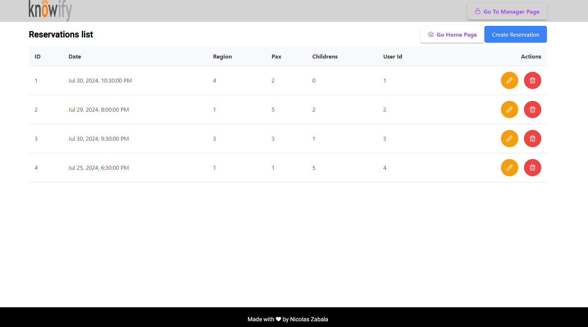

# knowy-reservations
Angular + ngrx +rjxs +  (knowy)

## Context

### Problem

***********Kafè*********** is a new Andorran restaurant that has gained immense notoriety since its grand opening in Manhattan’s Lower East Side. Kafè initially only served walk-in diners, but the owners have recently decided to accept reservations through their website with an in-house system. The process of making an online reservation for a popular restaurant can produce much anxiety for the user, especially if availability changes during the reservation-making process. The owners have repeatedly stressed that their reservation system must anticipate competition among potential patrons and attempt to mitigate the user's anxiety as these changes occur.

### Objective

Develop a single page application that allows a user to make a reservation for a restaurant in which lots of potential patrons are interested, at a date and time that the user selects between July 24 and July 31. The application should gather information from the user through a series of prompts, and finally confirm for the user that the reservation is made.

### Constraints

The restaurant takes reservations on every half-hour slot between 6 p.m. and 10 p.m., and it can accommodate parties of 12 or fewer people.  There are 4 dining regions within the restaurant, each having unique constraints. (All regions are non-smoking unless otherwise noted.)

- *`Main Hall`:* Seating 12 or fewer per table.
- *`Bar`:* Seating 4 or fewer per table; parties with children not permitted*.*
- *`Riverside`:* Seating 8 or fewer per table.
- *`Riverside` (smoking allowed):* Seating 6 or fewer per table; parties with children not permitted.

The restaurant needs the following information to confirm a reservation:

- The date and time desired for the reservation
- The user's name
- A valid email address
- A valid phone number
- The size of the party
- The user's region preference
- The number of children in the party
- Whether any party member would like to smoke during dinner
- Whether anyone in the party is celebrating a birthday
    - *Optional: The name of the person celebrating a birthday*

Once the user has made all necessary selections, and all selections are confirmed as available, the application should present the user with a "review page" (just another view of the SPA) at which the user may review all of the reservation request details that they have provided. On this review page, a user may click a "Confirm" button to confirm the reservation, or they may click any reservation detail to return to the corresponding prompt and edit the response. If confirmation is successful, the application should present the user with a “confirmation page” that displays all of the reservation details.

Until the user reaches the “confirmation page,” the application should continually reassess whether the restaurant can accommodate the user's current selections. As the application recognizes that a selection can no longer be accommodated, it should present the user with alternatives.

## Acceptance Criteria

- [x] Create landing page for make pre reservations
- [x] Create a form with all fields with the requeriments
    - [] bonus: smoking
    - [] bonus: birthday
- [x] Create form validations
    - [x] no child allowed by region
    - [x] no max party members exceed
- [x] Create confirmation page (review page)
- [x] Allow to edit before submit the reservation
- [x] **Extras**: create manager page to see all the reservations and edit the information
    - [x] Allow create a reservation directly from manager view page
    - [x] Allow edit a reservation info from manager view
    - [x] Allow remove a reservation
    - [x] add a go to manager / reservation view

NOTE: if you want to see the "go to manager page" button must add on local storage a key with "knowy-role" = admin

### some app screenshoots

